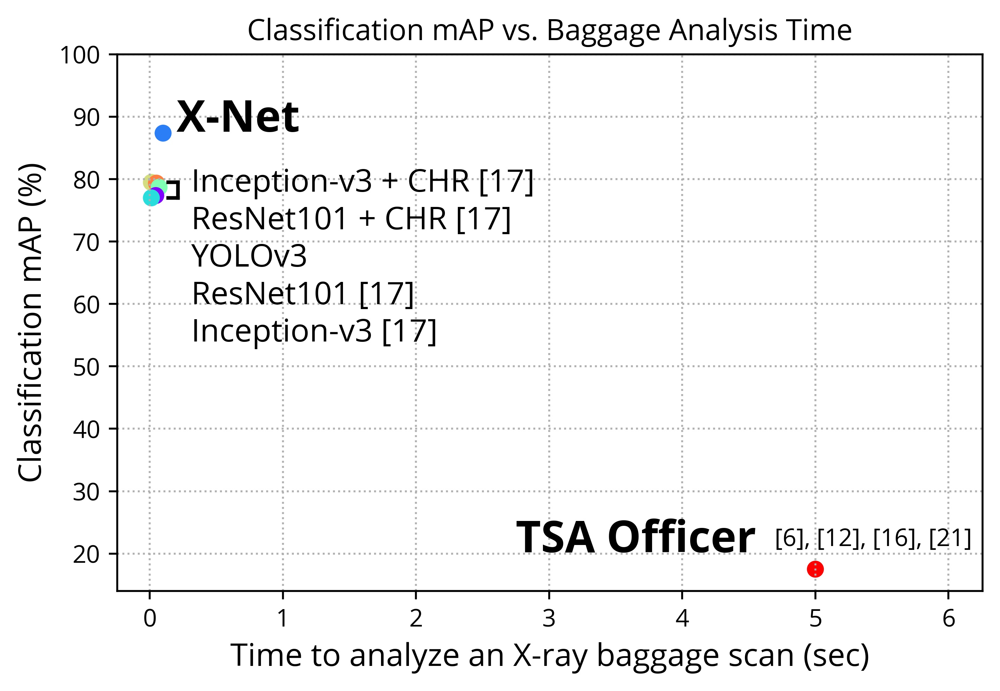
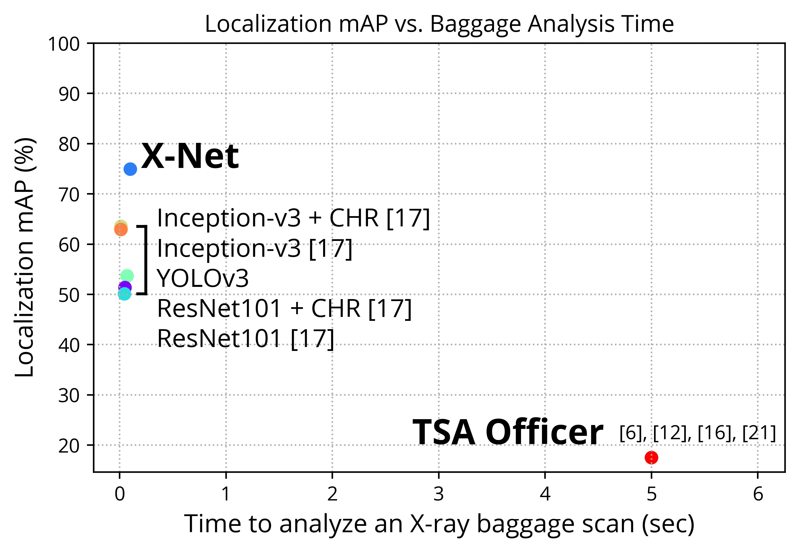
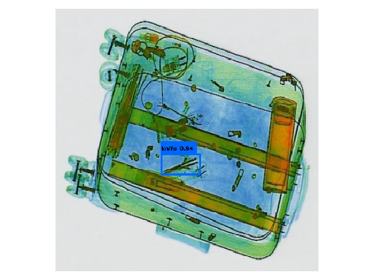

# x-net

A deep convolutional neural model for X-ray threat detection.

__Reuses some code from and is inspired by https://github.com/qqwweee/keras-yolo3.__

## About

Entry for NJRSF 2020, JSHS 2020, and MIT THINK 2020. 

## Data

Used the [SIXray dataset](https://github.com/MeioJane/SIXray).

## Results

### mAP

Classification Results                                     |  Localization Results                                  
:---------------------------------------------------------:|:-------------------------------------------------------:
  |  

### Examples

All correctly detected.

    |                                    
:--------------------------------------------:|:-------------------------------------------------------------:
          |  
